# 🚀 Sec360 by Abhay - Complete Setup & Run Guide

**Advanced Code Security Analysis Platform** - Cross-Platform Installation & Usage Guide

## 📋 **System Requirements**

### **Supported Operating Systems**
- **macOS** 12+ (Intel & Apple Silicon)
- **Windows** 10+ (x64 & ARM64)
- **Linux** (Ubuntu 20.04+, CentOS 8+, Debian 11+, Fedora 35+)

### **Hardware Requirements**
- **RAM**: 8GB+ (recommended for optimal performance)
- **Storage**: 2GB free space (for Ollama models)
- **Internet**: Required for initial setup and model downloads

### **Software Dependencies**
- **Python 3.11+** (required for Ollama compatibility)
- **Ollama AI Platform** (automatically installed by start script)
- **Git** (for cloning the repository)

---

## 🏗️ **Platform-Specific Setup**

### **🍎 macOS Setup**

#### **Prerequisites**
```bash
# Install Xcode Command Line Tools (if not already installed)
xcode-select --install
```

#### **Automatic Installation (Recommended)**
```bash
# Clone the repository
git clone <repository-url>
cd sec360

# Run the start script - it will handle everything automatically
./scripts/management/start.sh
```

#### **What the start script does on macOS:**
- ✅ **Detects system architecture** (Intel vs Apple Silicon)
- ✅ **Installs Homebrew** automatically if not present
- ✅ **Configures shell environment** (zsh/bash) for Homebrew
- ✅ **Installs Ollama** via Homebrew
- ✅ **Downloads llama3.2:3b model** automatically
- ✅ **Installs Python dependencies** (requests, psutil)
- ✅ **Starts all services** (Ollama + Sec360 app)

#### **Manual Installation (if needed)**
```bash
# Install Homebrew
/bin/bash -c "$(curl -fsSL https://raw.githubusercontent.com/Homebrew/install/HEAD/install.sh)"

# Add Homebrew to PATH (for Apple Silicon)
echo 'eval "$(/opt/homebrew/bin/brew shellenv)"' >> ~/.zshrc
source ~/.zshrc

# Install Ollama
brew install ollama

# Pull the required model
ollama pull llama3.2:3b
```

---

### **🪟 Windows Setup**

#### **Prerequisites**
- **Windows 10/11** (64-bit)
- **PowerShell** or **Command Prompt**
- **Git for Windows** (https://git-scm.com/download/win)

#### **Automatic Installation (Recommended)**
```cmd
# Clone the repository
git clone <repository-url>
cd sec360

# Run the start script
scripts\management\start.sh
```

#### **What the start script does on Windows:**
- ✅ **Detects Windows architecture** (x64/ARM64)
- ✅ **Installs Ollama** via Chocolatey (if available) or manual download
- ✅ **Downloads llama3.2:3b model** automatically
- ✅ **Installs Python dependencies** via pip
- ✅ **Starts all services** (Ollama + Sec360 app)

#### **Manual Installation (if needed)**
```cmd
# Install Chocolatey (if not installed)
Set-ExecutionPolicy Bypass -Scope Process -Force; [System.Net.ServicePointManager]::SecurityProtocol = [System.Net.ServicePointManager]::SecurityProtocol -bor 3072; iex ((New-Object System.Net.WebClient).DownloadString('https://community.chocolatey.org/install.ps1'))

# Install Ollama via Chocolatey
choco install ollama

# Or download manually from https://ollama.ai/download
# Then pull the required model
ollama pull llama3.2:3b
```

---

### **🐧 Linux Setup**

#### **Prerequisites**
- **Ubuntu 20.04+**, **CentOS 8+**, **Debian 11+**, or **Fedora 35+**
- **curl** and **wget** packages
- **sudo** access for package installation

#### **Automatic Installation (Recommended)**
```bash
# Clone the repository
git clone <repository-url>
cd sec360

# Make scripts executable
chmod +x scripts/management/*.sh

# Run the start script
./scripts/management/start.sh
```

#### **What the start script does on Linux:**
- ✅ **Detects Linux distribution** (Ubuntu, CentOS, Debian, Fedora)
- ✅ **Detects package manager** (apt, dnf, yum, zypper)
- ✅ **Installs Ollama** via appropriate package manager
- ✅ **Downloads llama3.2:3b model** automatically
- ✅ **Installs Python dependencies** via pip
- ✅ **Starts all services** (Ollama + Sec360 app)

#### **Manual Installation (if needed)**
```bash
# Ubuntu/Debian
curl -fsSL https://ollama.com/install.sh | sh

# CentOS/RHEL/Fedora
curl -fsSL https://ollama.com/install.sh | sh

# Pull the required model
ollama pull llama3.2:3b
```

---

## 📸 **Application Screenshots**

### **🎯 Main Interface**

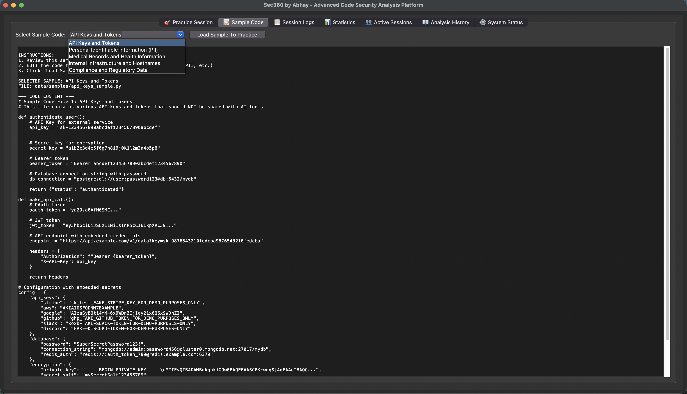

**Practice Session Tab** - Real-time code analysis with AI Security Mentor

---

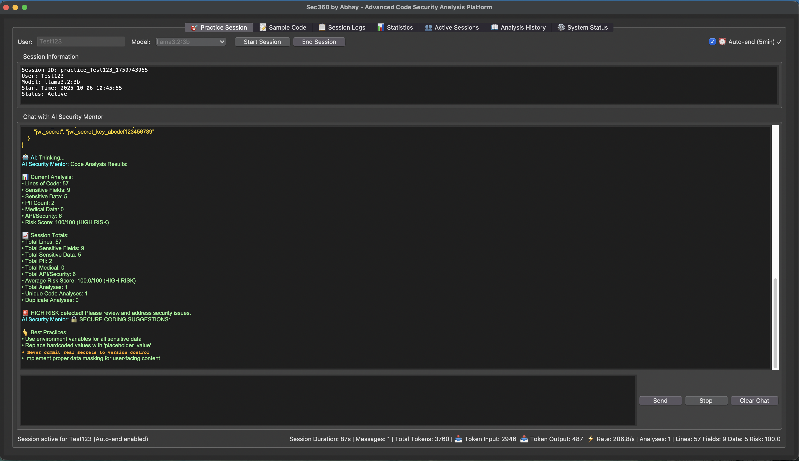

**AI Analysis Output** - Detailed risk assessment and recommendations

---

### **📊 Analysis & Monitoring**

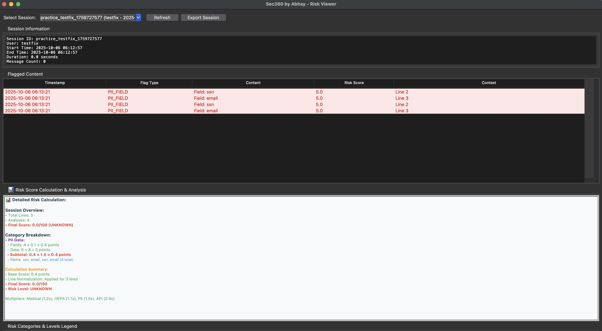

**Risk Score Details Viewer** - Comprehensive risk breakdown with calculations

---

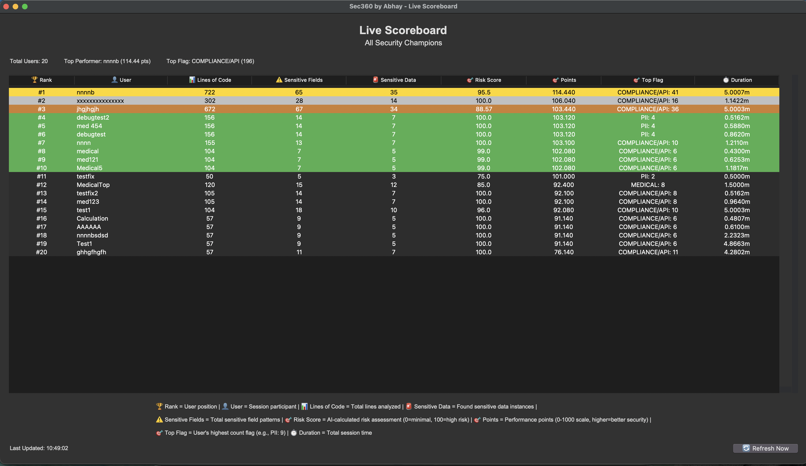

**Live Scoreboard** - Real-time user rankings and performance tracking

---

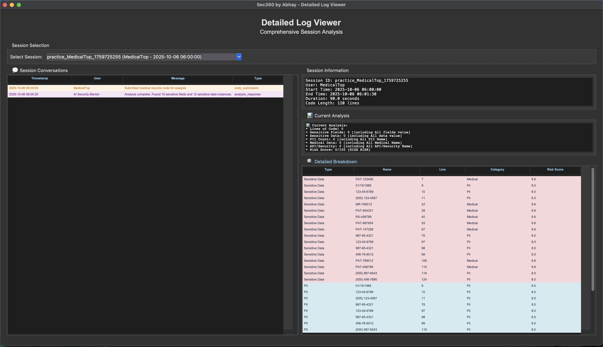

**Enhanced Log Viewer** - Detailed session analysis and conversation history

---

### **📋 Session Management**

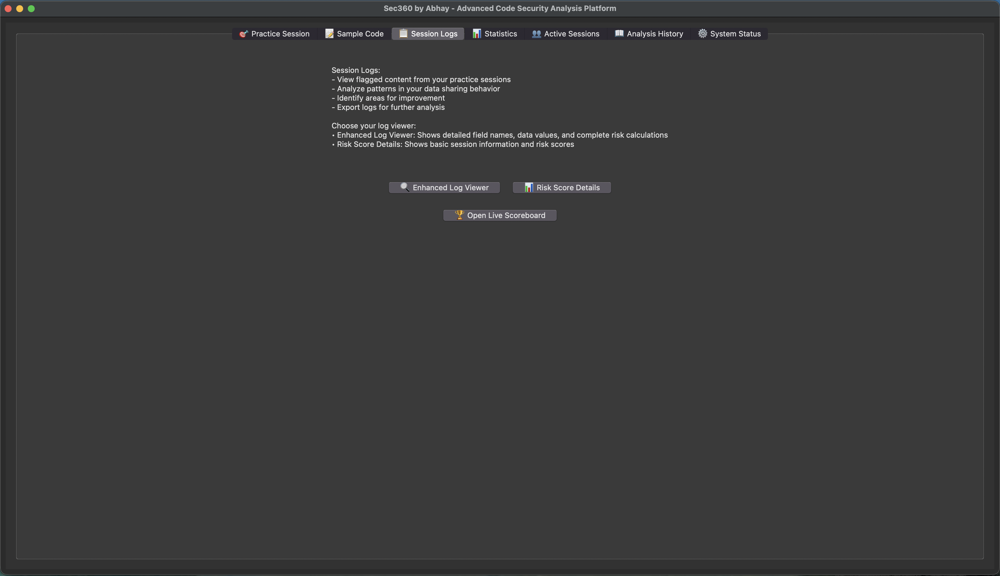

**Session Logs Tab** - Complete session history and analysis tracking

---

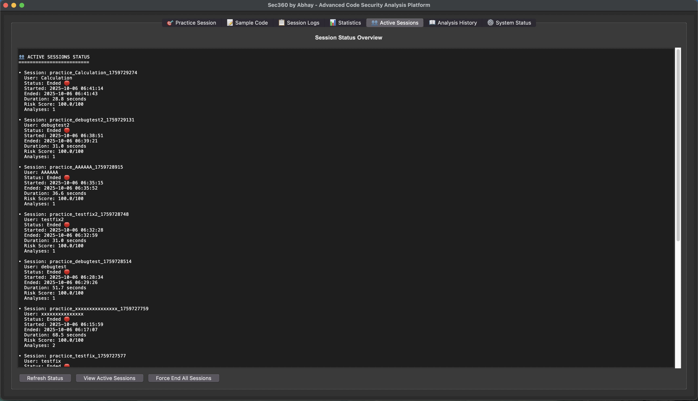

**Active Sessions Tab** - Real-time session monitoring and management

---

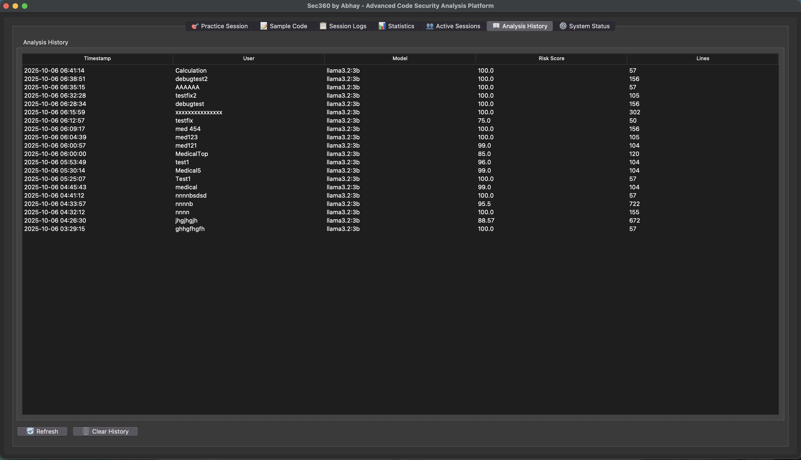

**Analysis History Tab** - Historical analysis data and trends

---

### **📈 Statistics & System**

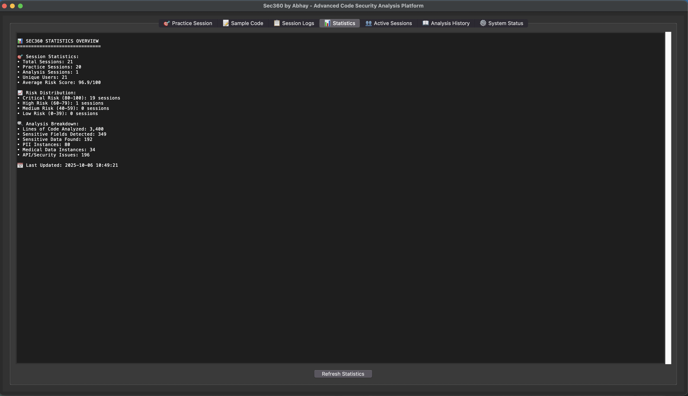

**Statistics Tab** - User performance metrics and improvement tracking

---

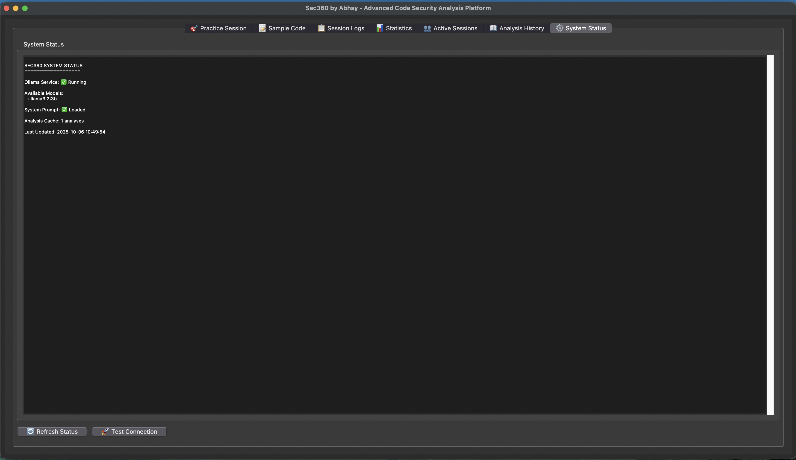

**System Status Tab** - Ollama service status and system health monitoring

---

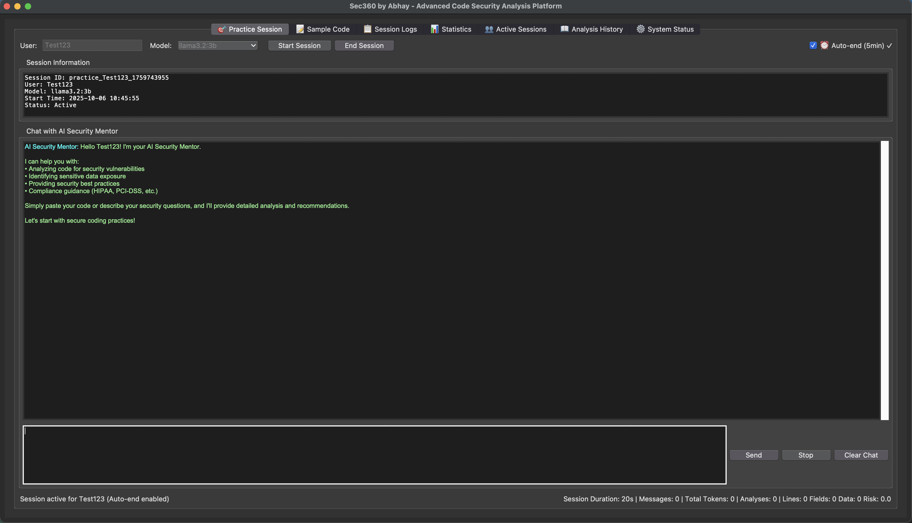

**Chat Interface** - Interactive AI Security Mentor with stop functionality

---

## 🚀 **Running the Application**

### **✅ Recommended Method: Using Start Script**

**This is the ONLY method you need to use for first-time setup and daily usage:**

```bash
# Navigate to the project directory
cd sec360

# Start the application (handles everything automatically)
./scripts/management/start.sh
```

**What happens when you run start.sh:**
1. 🔍 **System Detection** - Identifies your OS and architecture
2. 🧹 **Clean Startup** - Kills any existing processes
3. 📦 **Dependency Check** - Verifies Python 3.11+ and other requirements
4. 🔧 **Automatic Installation** - Installs missing dependencies
5. 🤖 **Ollama Setup** - Installs and configures Ollama
6. 📥 **Model Download** - Downloads llama3.2:3b model
7. 🚀 **Service Startup** - Starts Ollama and Sec360 application
8. ✅ **Status Verification** - Confirms everything is running

---

## 🛑 **Stopping the Application**

### **✅ Recommended Method: Using Stop Script**

```bash
# Stop all services cleanly
./scripts/management/stop.sh
```

**What the stop script does:**
- 🛑 **Graceful Shutdown** - Stops Sec360 application
- 🛑 **Ollama Shutdown** - Stops Ollama service
- 🧹 **Process Cleanup** - Kills any remaining processes
- 🔌 **Port Cleanup** - Frees up ports (11434, 8000, 5000, 3000)
- 📝 **Log Management** - Preserves logs for debugging

### **Advanced Stop Options**
```bash
# Stop with log cleanup
./scripts/management/stop.sh --clean

# Stop and show status only
./scripts/management/stop.sh --status
```

---

## 📁 **Project Structure**

```
sec360/
├── sec360.py                          # 🎯 Main application
├── README.md                           # 📖 Project overview
├── HOW_TO_RUN.md                      # 📋 This guide
├── FEATURES_AND_FUNCTIONALITY.md      # 📚 Complete feature documentation
├── requirements.txt                   # 📦 Python dependencies
├── config.json                        # ⚙️ Application configuration
├── core/                              # ⚙️ Core functionality
│   ├── analysis/                      # 🔍 AI analysis engine
│   ├── detection/                     # 🛡️ Data leak detection
│   ├── llm/                          # 🤖 Ollama integration
│   ├── logging_system/               # 📝 Logging system
│   ├── practice_session_manager.py   # 🎯 Session management
│   ├── scoring/                      # 📊 Scoring system
│   └── scoreboard/                   # 🏆 Performance tracking
├── data/                             # 📊 Sample data files
│   ├── samples/                      # 📝 Code samples
│   └── templates/                    # 📋 Templates
├── docs/                             # 📚 Documentation
│   ├── ENABLE_ANALYSIS_TAB.md        # 🔧 Advanced features
│   └── FINAL_TEST.md                 # ✅ Testing results
├── logs/                             # 📝 Application logs
├── scripts/                          # 🔧 Management scripts
│   ├── management/                   # 🚀 Start/stop/cleanup scripts
│   ├── setup/                        # ⚙️ Setup scripts
│   └── testing/                      # 🧪 Testing scripts
├── system_prompts/                   # 🤖 AI prompts
├── tests/                            # 🧪 Test files
└── ui/                               # 🎨 User interface
```

---

## 🧪 **Available Features**

### **1. 🎯 Practice Sessions**
- **Real-time code analysis** with AI-powered feedback
- **Security mentoring** focused on LLM data protection
- **Risk scoring** (0-100 scale) with detailed metrics
- **Duplicate detection** to track analysis patterns
- **Session persistence** with automatic resume capability
- **Stop button functionality** to interrupt AI responses
- **Automatic detailed session creation** for comprehensive analysis
- **Enhanced risk viewer** with field/data breakdown and calculations

### **2. 📊 Analysis Engine**
- **Lines of Code** tracking and analysis
- **Sensitive Fields** identification and counting
- **Sensitive Data** detection and classification
- **PII Detection** (Personally Identifiable Information)
- **Medical Records** analysis (HIPAA compliance)
- **HEPA/Healthcare Data** analysis
- **Compliance/API** security validation
- **Token usage tracking** for cost management

### **3. 🔍 Data Leak Detection**
- **API Key Detection**: API keys, access tokens, secret keys
- **PII Detection**: SSN, credit cards, emails, phone numbers
- **Medical Data Detection**: Patient names, diagnoses, medical records
- **Internal Infrastructure**: Hostnames, internal IPs, session IDs
- **Compliance Keywords**: GDPR, HIPAA, SOX, PCI-DSS related terms

### **4. 📈 Scoring System**
- **Points-based ranking** system (0-100 scale)
- **Performance levels**: Excellent (90+), Good (80+), Fair (70+), Poor (60+), Critical (<60)
- **User profile tracking** with session history
- **Improvement area identification**

### **5. 📋 Session Management**
- **Real-time session monitoring**
- **User session management**
- **Session history** and analysis tracking
- **Export capabilities** for reports
- **Search and filter** functionality
- **Automatic detailed session file creation**
- **Enhanced log viewers** with risk breakdowns

---

## 🔧 **Troubleshooting**

### **🍎 macOS Issues**

#### **Homebrew Issues**
```bash
# Reinstall Homebrew
/bin/bash -c "$(curl -fsSL https://raw.githubusercontent.com/Homebrew/install/HEAD/uninstall.sh)"
/bin/bash -c "$(curl -fsSL https://raw.githubusercontent.com/Homebrew/install/HEAD/install.sh)"

# Fix Homebrew permissions
sudo chown -R $(whoami) $(brew --prefix)/*
```

#### **Shell Configuration Issues**
```bash
# Configure shell environment manually
./scripts/setup/configure_shell.sh

# Or manually add to ~/.zshrc (Apple Silicon)
echo 'eval "$(/opt/homebrew/bin/brew shellenv)"' >> ~/.zshrc
source ~/.zshrc
```

#### **Ollama Issues**
```bash
# Check Ollama status
ollama list

# Restart Ollama service
brew services restart ollama

# Test model
ollama run llama3.2:3b "Hello, world!"
```

---

### **🪟 Windows Issues**

#### **PowerShell Execution Policy**
```powershell
# Allow script execution
Set-ExecutionPolicy -ExecutionPolicy RemoteSigned -Scope CurrentUser

# Or run PowerShell as Administrator
Set-ExecutionPolicy Bypass -Scope Process -Force
```

#### **Chocolatey Issues**
```cmd
# Reinstall Chocolatey
powershell -Command "Set-ExecutionPolicy Bypass -Scope Process -Force; [System.Net.ServicePointManager]::SecurityProtocol = [System.Net.ServicePointManager]::SecurityProtocol -bor 3072; iex ((New-Object System.Net.WebClient).DownloadString('https://community.chocolatey.org/install.ps1'))"

# Update Chocolatey
choco upgrade chocolatey
```

#### **Ollama Issues**
```cmd
# Check Ollama status
ollama list

# Restart Ollama service
ollama serve

# Test model
ollama run llama3.2:3b "Hello, world!"
```

---

### **🐧 Linux Issues**

#### **Permission Issues**
```bash
# Fix script permissions
chmod +x scripts/management/*.sh
chmod +x scripts/setup/*.sh

# Fix directory permissions
sudo chown -R $USER:$USER .
```

#### **Package Manager Issues**
```bash
# Ubuntu/Debian - Update package lists
sudo apt update && sudo apt upgrade

# CentOS/RHEL/Fedora - Update packages
sudo dnf update
# or
sudo yum update
```

#### **Ollama Issues**
```bash
# Check Ollama status
ollama list

# Restart Ollama service
sudo systemctl restart ollama

# Test model
ollama run llama3.2:3b "Hello, world!"
```

---

### **🔧 Common Issues (All Platforms)**

#### **Port Conflicts**
```bash
# Check port 11434 (Ollama default)
lsof -i :11434
# or on Windows
netstat -ano | findstr :11434

# Kill conflicting processes
# macOS/Linux
sudo lsof -ti:11434 | xargs kill -9
# Windows
taskkill /PID <PID> /F
```

#### **Python Issues**
```bash
# Check Python version
python3 --version

# Reinstall dependencies
pip3 install --upgrade -r requirements.txt

# Check Python path
which python3
```

#### **Memory Issues**
```bash
# Check available memory
# macOS
system_profiler SPHardwareDataType | grep "Memory"

# Linux
free -h

# Windows
wmic computersystem get TotalPhysicalMemory
```

#### **Model Issues**
```bash
# Check available models
ollama list

# Re-download model
ollama pull llama3.2:3b

# Remove and reinstall model
ollama rm llama3.2:3b
ollama pull llama3.2:3b
```

---

## 📊 **Advanced Usage**

### **🔧 Configuration Options**

#### **Model Selection**
The application uses `llama3.2:3b` by default. To use a different model:
1. Download the model: `ollama pull <model-name>`
2. Update `config.json`:
```json
{
  "core_settings": {
    "default_model": "llama3.2:1b"
  }
}
```

#### **Performance Tuning**
For better performance on different hardware:
```json
{
  "core_settings": {
    "analysis_timeout": 60,
    "max_cache_size": 200
  }
}
```

### **🧹 Maintenance**

#### **Weekly Cleanup**
```bash
# Clean up session files and logs
./scripts/management/cleanup.sh
```

#### **Complete Uninstall**
```bash
# Remove all dependencies and files
./scripts/management/uninstall.sh
```

#### **Backup Sessions**
```bash
# Backup session data
cp -r core/logs/sessions/ ~/backups/$(date +%Y%m%d)_session_backup/
```

---

## 🎯 **Quick Start Guide**

### **First-Time Setup (All Platforms)**
```bash
# 1. Clone the repository
git clone <repository-url>
cd sec360

# 2. Run the start script (handles everything automatically)
./scripts/management/start.sh

# 3. Wait for setup to complete (5-10 minutes depending on internet speed)

# 4. Application will start automatically
```

### **Daily Usage**
```bash
# Start the application
./scripts/management/start.sh

# Use the application (Practice Sessions tab)

# Stop when done
./scripts/management/stop.sh
```

### **Testing the Application**
1. **Start Application**: Run `./scripts/management/start.sh`
2. **Open Practice Session Tab**
3. **Start Session**: Enter username (e.g., "test")
4. **Send Sample Code**: Use dropdown to load sample code
5. **Verify Analysis**: Check risk score and recommendations
6. **Test Stop Button**: Click stop button during AI response
7. **Check Statistics**: Review session metrics

---

## 📞 **Support & Resources**

### **📚 Documentation**
- **`README.md`**: Basic project overview
- **`FEATURES_AND_FUNCTIONALITY.md`**: Complete feature documentation
- **`docs/ENABLE_ANALYSIS_TAB.md`**: Advanced analysis features
- **`docs/FINAL_TEST.md`**: Testing and validation results

### **📝 Log Files**
- **Application logs**: `logs/application.log`
- **Ollama logs**: `logs/ollama.log`
- **Session data**: `core/logs/sessions/`
- **Debug output**: Console output during startup

### **🔧 Management Scripts**
- **`scripts/management/start.sh`**: Complete setup and startup
- **`scripts/management/stop.sh`**: Clean shutdown
- **`scripts/management/cleanup.sh`**: Session cleanup
- **`scripts/management/uninstall.sh`**: Complete removal
- **`scripts/setup/configure_shell.sh`**: Shell configuration

### **❓ Common Issues & Solutions**

| Issue | Solution |
|-------|----------|
| "Ollama not found" | Run `./scripts/management/start.sh` - it will install Ollama automatically |
| "Model not available" | The start script automatically downloads `llama3.2:3b` |
| "Port 11434 in use" | The stop script handles port cleanup automatically |
| "Python 3.11+ required" | Update Python or the start script will guide you |
| "Permission denied scripts" | Run `chmod +x scripts/management/*.sh` |
| "Homebrew not found (macOS)" | The start script installs Homebrew automatically |
| "Chocolatey not found (Windows)" | The start script handles Windows installation |
| "Package manager not found (Linux)" | The start script detects and uses appropriate package manager |

---

## 🎉 **You're Ready!**

**Sec360 by Abhay** is now ready to help you practice secure coding and prevent sensitive data exposure to AI tools.

### **🚀 Quick Commands Summary**
```bash
# Start everything (first time and daily use)
./scripts/management/start.sh

# Stop everything
./scripts/management/stop.sh

# Clean up sessions
./scripts/management/cleanup.sh

# Complete uninstall
./scripts/management/uninstall.sh
```

**Happy secure coding! 🛡️**

---

## 🆕 **Recent Updates**

### **v2.1.0 - Enhanced Analysis & Risk Viewer**
- ✅ **Automatic detailed session creation** - Sessions now automatically generate comprehensive analysis files
- ✅ **Enhanced risk viewer** - Complete breakdown of field/data calculations with multipliers
- ✅ **Improved session management** - Better handling of session end scenarios
- ✅ **Enhanced debugging** - Comprehensive logging for troubleshooting
- ✅ **Cross-platform compatibility** - All features work seamlessly across macOS, Windows, and Linux

### **Key Improvements**
- **Risk Score Details Viewer**: Now displays accurate field counts, data points, and calculation breakdowns
- **Category Breakdown**: Shows PII, Medical, HEPA, and API/Security data with individual multipliers
- **Session Persistence**: Enhanced session file creation for both regular and detailed analysis
- **Management Scripts**: Updated cleanup and deletion scripts to handle new file structures

---

*Last Updated: October 2025*
*Cross-Platform Support: macOS, Windows, Linux*
*Automated Setup: One-command installation and startup*
*Enhanced Features: Automatic detailed session creation and risk viewer*